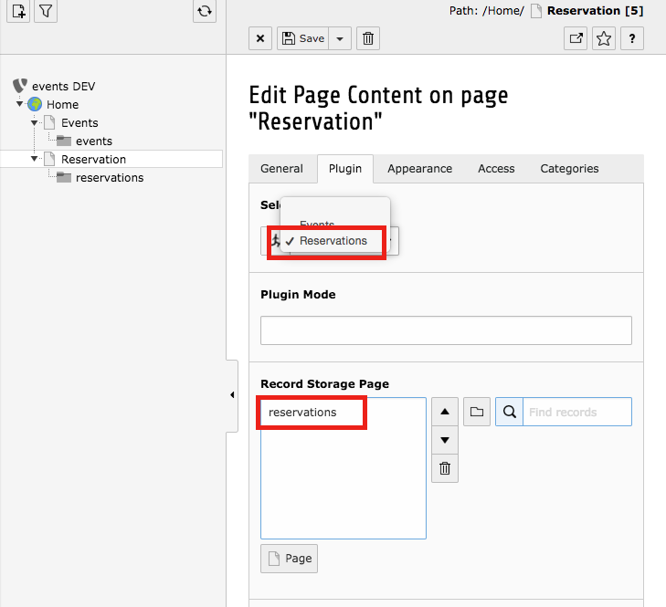

Configuration
=============

## Include TypoScript
Include the default TypoScript from extension t3events and t3events_reservation in your template record.

Set constants 

```
plugin.tx_t3eventsreservation.persistence.storagePid = <id of storage folder for reservations>
module.tx_t3eventsreservation.persistence.storagePid = <id of storage folder for reservations>
```

## Plugins
You will need two plugins: 

* one for list and detail views of events (Please see t3events documentation for details)
* one for  the reservation forms 

Create a new page and insert a plugin of type *Reservation* (Create a *General Plugin* and select _Reservations_)
Add your storage folder to the _Record Storage Page_ selection.



## Templates

### Paths
The default templates are located in the Resources/Private/ folder of the extension: 

```
plugin.tx_t3eventsreservation.view {
 templateRootPaths {
  10 = EXT:t3events_reservation/Resources/Private/Templates/
  20 = EXT:t3events/Resources/Private/Templates/
 }
 partialRootPaths {
  10 = EXT:t3events_reservation/Resources/Private/Partials/
  20 = EXT:t3events/Resources/Private/Partials/
 }
 layoutRootPaths {
  10 = EXT:t3events_reservation/Resources/Private/Layouts/
  20 = EXT:t3events/Resources/Private/Layouts/
 }
}
```

They can be extended by defining additional paths:
```
plugin.tx_t3eventsreservation.view {
 templateRootPaths {
  10 = EXT:t3events_reservation/Resources/Private/Templates/
  20 = EXT:t3events/Resources/Private/Templates/
  30 = path/to/additional/templates
 }
}
```
You should add only those files which need to be changed.
**Please note**: The default configuration already adds the *t3events* paths because there exist common templates and partials.

### Necessary adjustments

You will need a link from the events detail or list view to your registration plugin. 

```xml
<f:link.action  
    action="new"
    pageUid="{settings.reservation.detailPid}" 
    extensionName="t3eventsreservation"
    pluginName="pi1" 
    controller="Reservation" 
    arguments="{lesson: performance}"
    noCacheHash="TRUE"
    noCache="TRUE" >
    {f:translate(key: 'button.registerOnline', default: 'register')}
</f:link.action>

```

This link should point to your reservation plugin page. Clicking it should present an _new reservation_ form now. If you experience redirect, please check your argument for [validity](./Validation.md).

