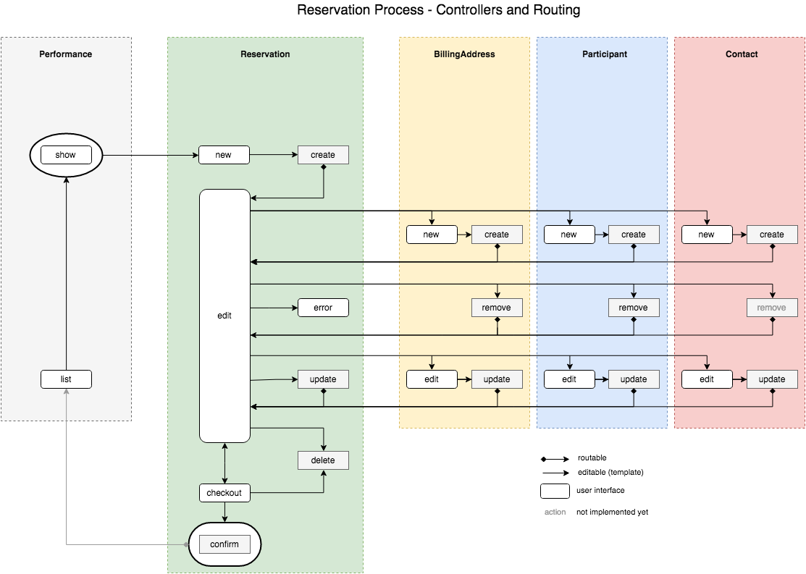

Routing
=======

## Overview
_Reservations_ provides a flexible mechanism which allows to route requests between controllers and actions. 

When a routable action has been finished, the router determines which action should be called next.  
The diagram below shows the default routing. 

Currently the routing can only be configured by programming. Please see section [Outlook](#outlook) for upcoming features.


see [pdf](Reservation-Flow.pdf) and [svg](./Images/Reservation-Flow.svg) version

## Custom Routes
> "That's way to complicated! I want one step registration for my users."

Define your own routes by either registering a single route or loading multiple routes from a data provider.  

### Register a single route
```php
/** @var DWenzel\T3events\Service\RouteLoader $routeLoader */
$routeLoader = \TYPO3\CMS\Core\Utility\GeneralUtility::makeInstance(\DWenzel\T3events\Service\RouteLoader::class);
$routeLoader->register(
    // origin
    \CPSIT\T3eventsReservation\Controller\ReservationController::class . '|create',
    // method
    'forward',
    // options
    [
        'actionName' => 'show',
        'controllerName' => 'Bar',
        'extensionName' => 'myExtension,
        'arguments' => ['foo' => 'bar],
    ]
);
```
The example above registers a single route with the RouteLoader.  
The router will interpret this route as:

> "After create action of ReservationController forward the request to show action of BarController, provided by myExtension, passing argument _foo_ with value _bar_"

Any existing route with the same origin will be replaced.

### Load routes from data provider
```php
/** @var DWenzel\T3events\Service\RouteLoader $routeLoader */
$routeLoader = \TYPO3\CMS\Core\Utility\GeneralUtility::makeInstance(\DWenzel\T3events\Service\RouteLoader::class);
$dataProviderClasses = [
    \CPSIT\T3eventsReservation\DataProvider\RouteLoader\ReservationControllerDefaults::class,
    \CPSIT\T3eventsReservation\DataProvider\RouteLoader\ParticipantControllerDefaults::class,
    \CPSIT\T3eventsReservation\DataProvider\RouteLoader\ContactControllerDefaults::class,
    \CPSIT\T3eventsReservation\DataProvider\RouteLoader\BillingAddressControllerDefaults::class
];
foreach ($dataProviderClasses as $providerClass) {
    $dataProvider = \TYPO3\CMS\Core\Utility\GeneralUtility::makeInstance($providerClass);
    $routeLoader->loadFromProvider($dataProvider);
}

```
The example above registers the default route for all routing controllers in t3events_reservation using the default data providers.
Implement custom data providers if you want to change multiple routes at once.

### Manipulate routes or arguments
While dispatching, the router emits a signal _dispatchBegin_ passing 
 * arguments from origin
 * route identifier and 
 * route.  

Implement a handler for this signal and register it with the signal slot dispatcher if you want to manipulate any argument or the behaviour of the route.

## Outlook

We plan to implement a mechanism which allows to configure routing via TypoScript.  
A file loader automatically reading for instance Yaml would be cool.
